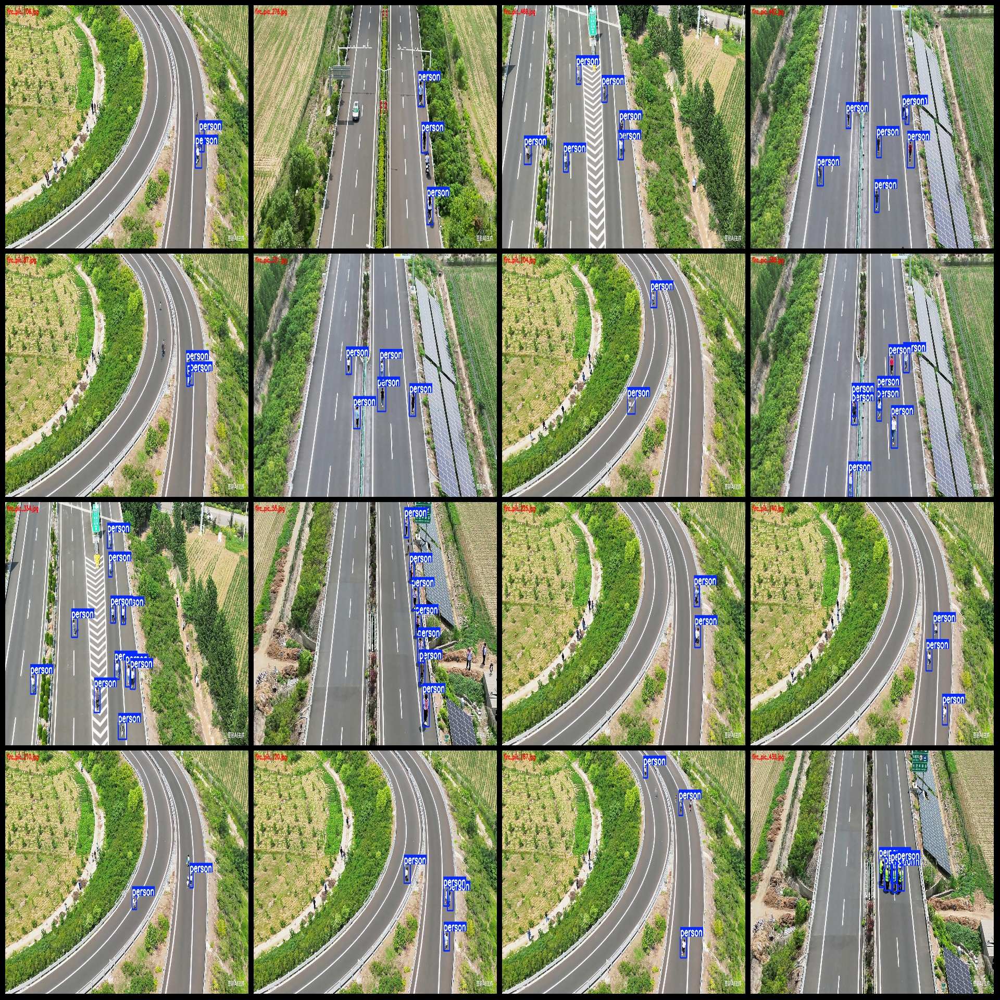
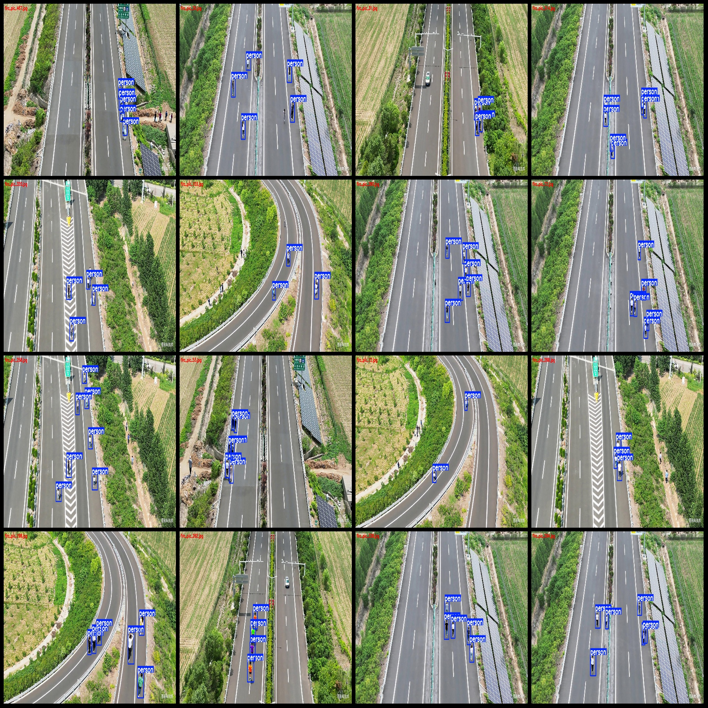

# UAV Perspective aerial photography dataset for pedestrian intrusion detection: VOC+YOLO format, 484 images with 1 category

Dataset format: Pascal VOC format + YOLO format (txt file without split paths, only containing jpg images and corresponding VOC format xml files and YOLO format txt files)
Number of images (jpg file count): 484
Number of annotations (xml file count): 484
Number of annotations (txt file count): 484
Number of annotation categories: 1
Annotation category name: "person"
Total number of boxes per category: 2324
Total number of boxes: 2324
Number of images per category: 484
Image resolution: 1536x864
Annotation tool used: labelImg
Annotation rules: draw rectangle boxes for each category
Important note: The dataset does not have split into training, validation, or test sets. Please perform your own splitting.
Special declaration: This dataset does not guarantee the accuracy of the trained models or weight files.
Image preview:
Annotation example:

## Images

Here is a pay link on Stripe ( https://buy.stripe.com/3cs8yP7sY87d0vu9AB ). Please contact me lonlonago@foxmail.com after funding $89, and I will send you a complete data files , thank you!

